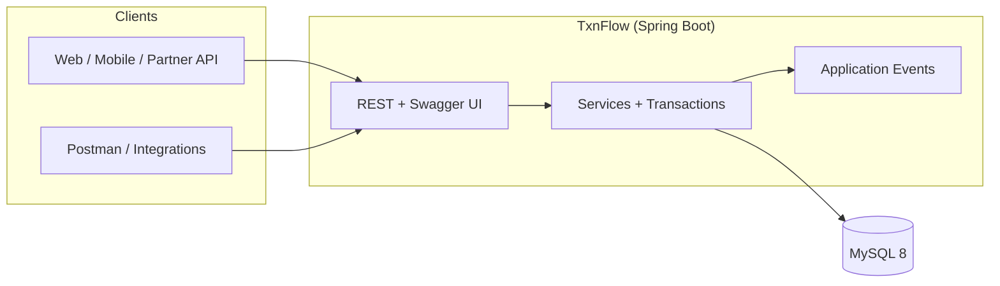
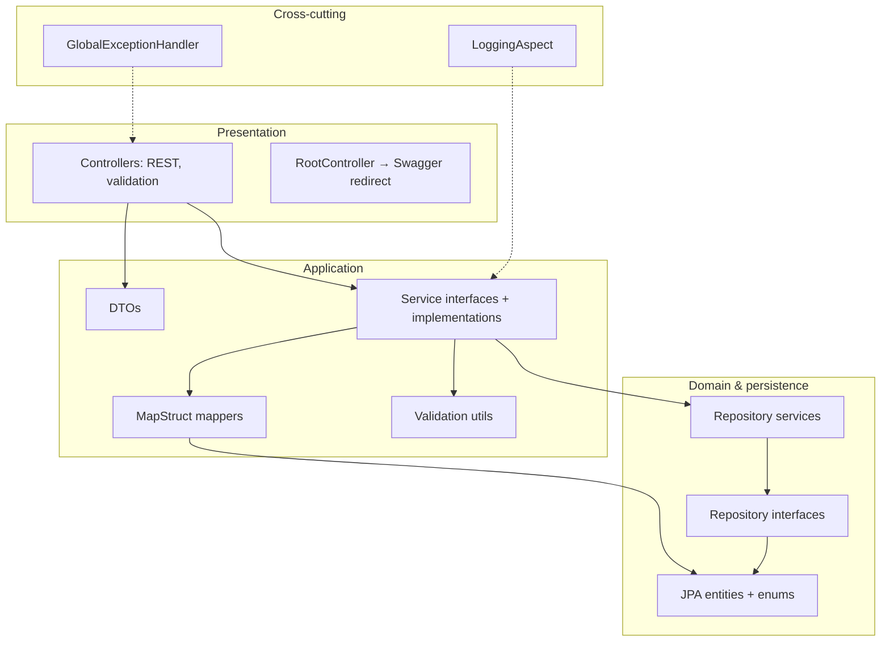
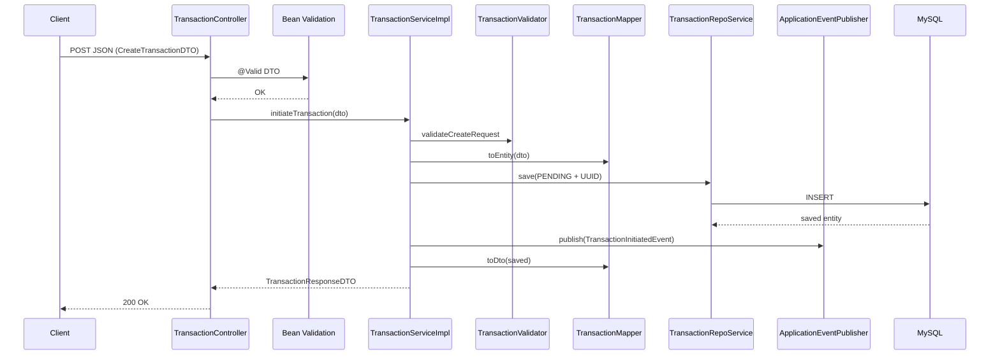
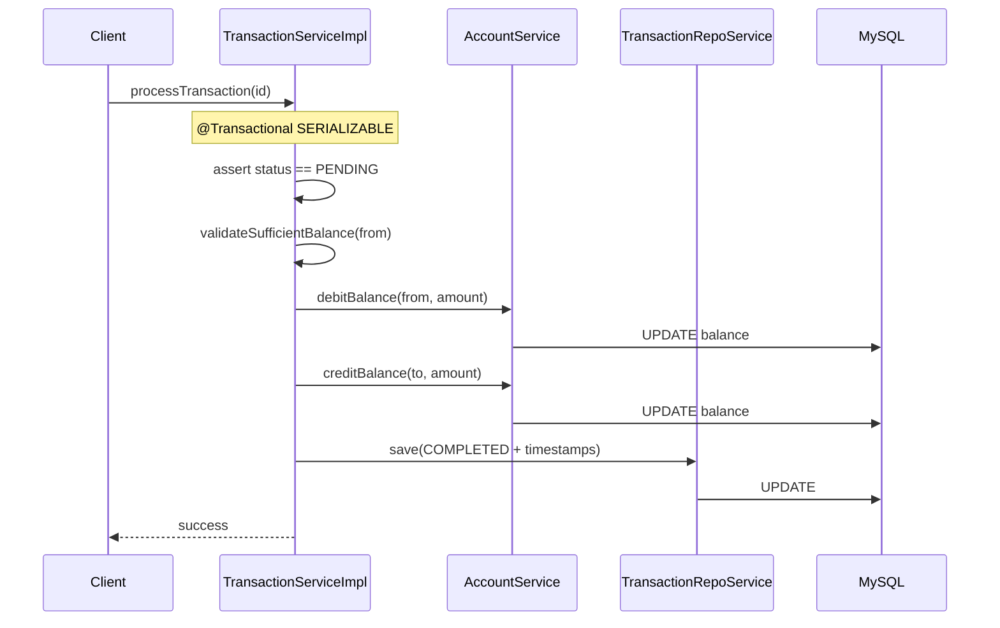
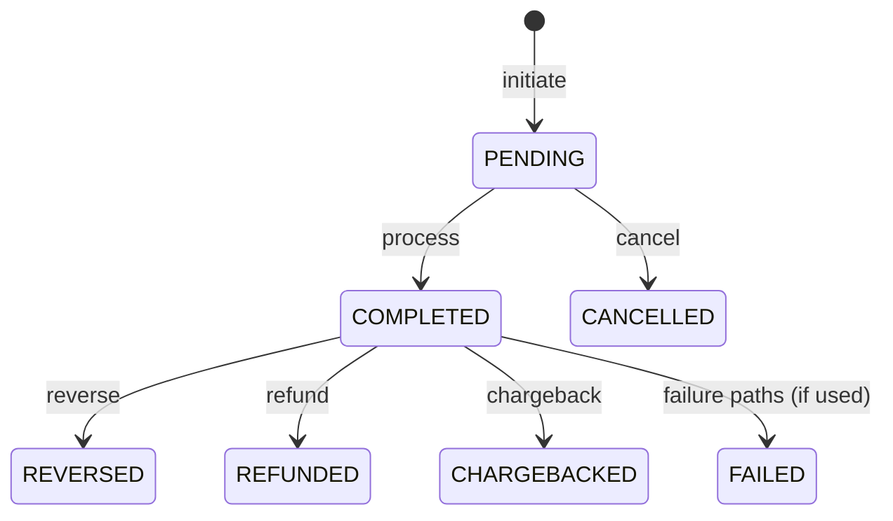
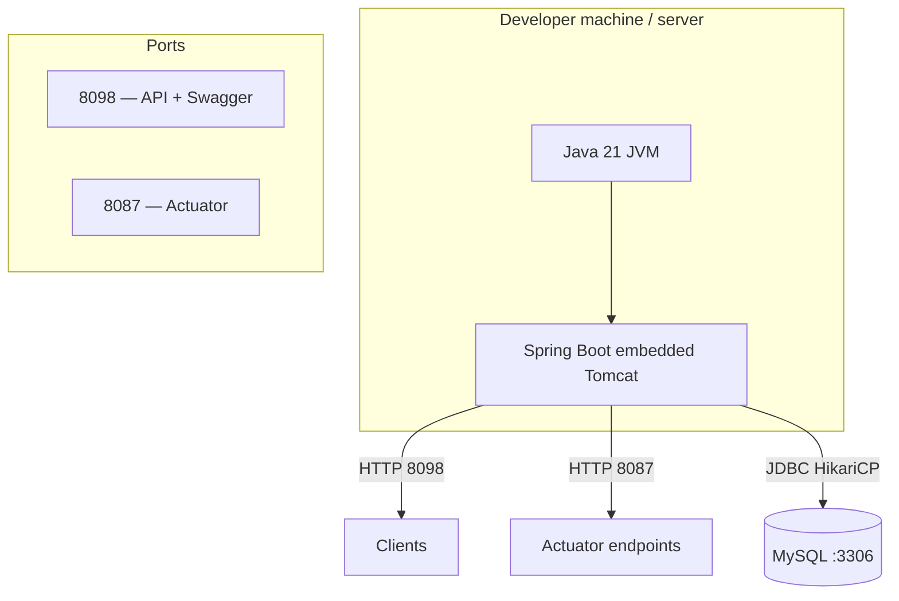
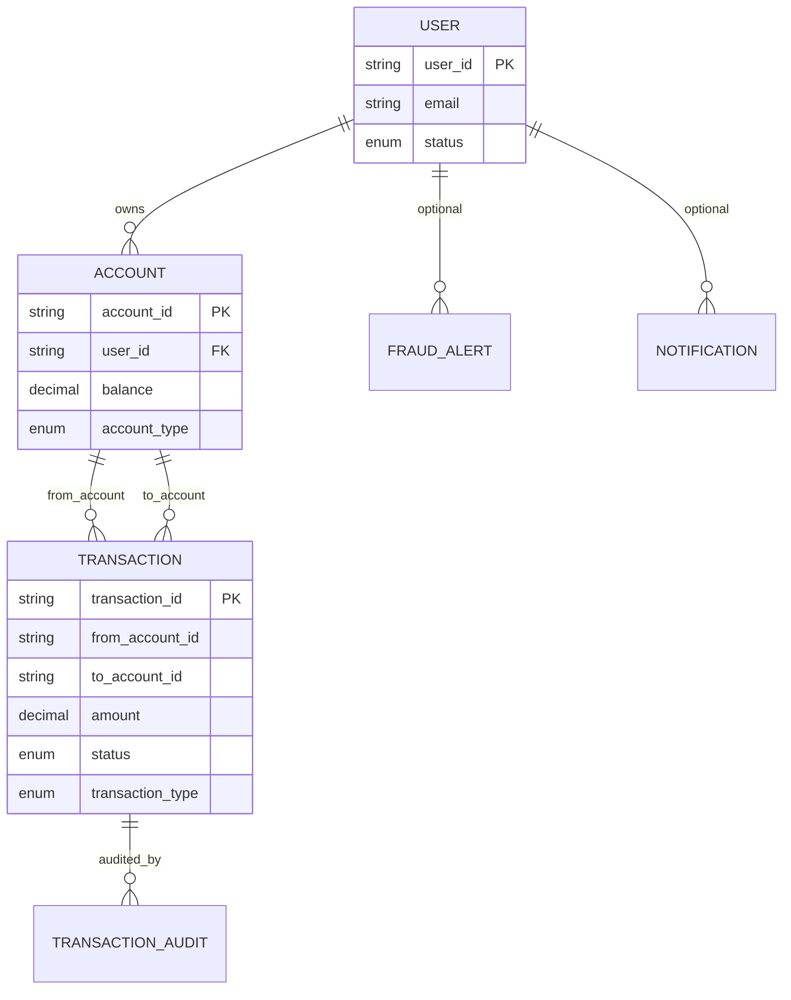

# TxnFlow — Interview Guide & System Design

Use this document to prepare for technical interviews.

---

## 0. What this application does (plain English)

**In one sentence:** TxnFlow is a **backend-only REST API** that lets clients manage **users**, **bank-style accounts**, and **money movement** between accounts, with rules for **transaction states** and supporting **fraud alerts**, **notifications**, and **audit history**.

**Concrete capabilities (what you can do via the API):**

| Area | What the system supports |
|------|---------------------------|
| **Users** | Create and manage user records (identity, KYC status, account status). |
| **Accounts** | Open and manage accounts per user (types like savings, wallet, etc.), **balances**, status (active, frozen, etc.). |
| **Transactions** | **Initiate** a transfer (stored as **PENDING**), then **process** it (debit source, credit destination → **COMPLETED**), or **cancel** while pending. After completion: **refund**, **reverse**, or **chargeback** (reverse funds with status checks). |
| **Cash movements** | **Deposit** and **withdraw** on an account (credit/debit balance). |
| **Fraud** | Create and manage **fraud alerts** tied to the domain. |
| **Notifications** | Create and track **notifications** (channels, types, delivery status). |
| **Audit** | Record **transaction audit** entries (e.g. status transitions for compliance / debugging). |
| **Queries** | Read-side APIs for listing or filtering transactions (via dedicated query endpoints). |

**What it is *not*:** There is **no web or mobile UI** in this repo—only **JSON APIs** and **Swagger UI** to try them. Real “customers” would be another app or service calling these endpoints.

**Good one-liner for interviews:** “It’s the **transaction and ledger core** you’d put behind a payments app or internal treasury tool.”

---

## 1. Elevator pitch (≈30 seconds)

> “**TxnFlow** is a **Spring Boot 3** backend that models the **core of a payments / neobank platform**: users and accounts, **transaction lifecycle** from initiation through settlement and post-settlement actions—**cancel, refund, reverse, chargeback**—plus **fraud alerts**, **notifications**, and **transaction audit** for traceability. It’s built as a **layered monolith**: REST controllers expose **DTOs**, **MapStruct** maps to JPA entities, **services** own business rules and **Spring transactions** with **tuned isolation** where money moves, and **AOP** adds consistent logging across service implementations. **OpenAPI/Swagger** documents the API; **Actuator** exposes health and metrics on a separate port.”

---

## 2. Two-minute deep dive (memorize the flow)

**Problem:** Financial systems need **atomic balance changes**, **strict state transitions**, and **clear error contracts**—not generic CRUD.

**Solution:** A **single deployable service** with **clean separation**:

| Layer | Responsibility |
|--------|----------------|
| **Controllers** | HTTP, `jakarta.validation`, delegate to services |
| **DTOs** | Stable API surface; no entity leakage |
| **Mappers (MapStruct)** | Compile-time entity ↔ DTO mapping |
| **Validators** | Domain rules beyond annotations |
| **Services** | Orchestration, `@Transactional`, event publication |
| **Repository layer** | Spring Data JPA + thin repo services |
| **Entities / enums** | Persistence model and typed states |
| **Global exception handler** | Consistent JSON errors |
| **AOP (`LoggingAspect`)** | Cross-cutting logs + timing on `service_impls` |

**Money path (example):** Client **initiates** a transaction → persisted as **PENDING** → **process** validates balance, **debits** source, **credits** destination, marks **COMPLETED** inside a transaction. **Refund / reverse / chargeback** reverse the flow with status guards.

**Credibility line:** “I use **stronger isolation (`SERIALIZABLE`)** on transfer-style operations where concurrency could corrupt balances; I’d validate that under load and consider **optimistic locking** at scale.”

---

## 3. High-level system context

Who talks to what in one picture.

---

## 4. Layered architecture (internal design)

---

## 5. Request lifecycle (sequence)

Typical **POST /api/transactions** flow.

---

## 6. Process transaction (money movement)

---

## 7. Transaction state machine (conceptual)

Rules in code enforce which transition is allowed (e.g. only **PENDING** → process/cancel).

---

## 8. Deployment / runtime view

---

## 9. Simplified domain model (ER-style)

Logical relationships (actual FK strategy follows your JPA mappings and string IDs like `user_id`, `account_id`).

---

## 10. Tech stack (quick reference)

| Area | Technology |
|------|------------|
| Runtime | Java 21 |
| Framework | Spring Boot 3.5 (Web, Data JPA, Validation, AOP, Actuator) |
| API docs | Springdoc OpenAPI (Swagger UI) |
| Database | MySQL 8, Hibernate 6 |
| Mapping | MapStruct + Lombok |
| Build | Maven (`mvnw`) |

---

## 11. Strong answers to common questions

**Why monolith?**  
Single team, single deploy, **strong consistency** for money in one process; can extract services later at bounded boundaries.

**Why DTOs + MapStruct?**  
Stable API, no leaking entities, **compile-time** mapping reduces bugs.

**Why `@Transactional` / isolation?**  
**Atomicity** for debit+credit+status; **SERIALIZABLE** on sensitive paths reduces race conditions (with a trade-off in throughput).

**Where would you improve next?**  
**Idempotency keys** for POST, **integration tests** for money paths, **secrets** from env/vault, **`@Version`** optimistic locking, **structured JSON logs** + **correlation IDs**, **`@TransactionalEventListener(AFTER_COMMIT)`** for side effects.

**Event-driven?**  
`ApplicationEventPublisher` publishes **domain events** after writes; natural extension is **async listeners** for notifications and analytics without blocking the critical path.

---

## 12. Honest scope (avoid overclaiming)

- **API-only:** no production SPA in this repo; clients are HTTP consumers.
- **Package naming:** Java packages still use `FinancialTransactionProcessor`; product name **TxnFlow** is branding—say “legacy package root” if asked.
- **Events:** Infrastructure exists for handlers; wiring can be extended with Spring `@EventListener` / transactional listeners as you evolve the project.

---

## 13. Rendering diagrams

- **GitHub:** Mermaid renders in `.md` files automatically.
- **VS Code / Cursor:** Use a Mermaid preview extension.
- **Interview (whiteboard):** Redraw **Figure 4** (layers) and **Figure 7** (state machine)—they interview well in 60 seconds.

---

*Good luck — lead with the problem (money + consistency), then layers, then one concrete flow (initiate → process).*
