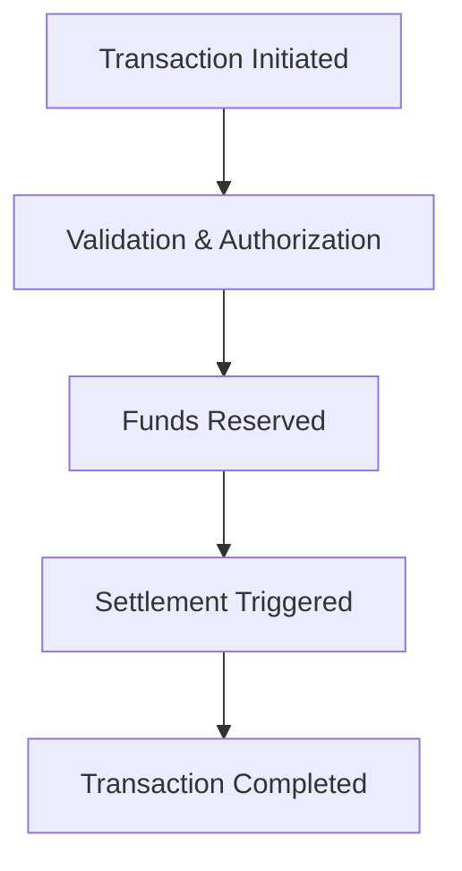

# 💸 PayTrack: SAAS based Financial Transaction Processor

An **enterprise-grade financial transaction processing system** built for **high-frequency trading**, **digital payments**, and **real-time settlements**. Designed with precision, modularity, and performance in mind — this backend powerhouse leverages **Spring Boot**, **event-driven design**, and **clean architecture** to orchestrate secure and scalable financial operations.

---

## 🧱 Project Structure

```
src/main/java/com/FinancialTransactionProcessor/
├── FinancialTransactionProcessorApplication.java ← Spring Boot entry point
├── aop/                          ← Aspect-Oriented Programming (logging, security)
├── configs/                      ← Application configuration classes
├── controllers/                 ← REST APIs for transaction operations
├── dtos/                         ← Request/response models
├── entities/                     ← JPA entities mapped to DB tables
├── enums/                        ← Domain enums (status, types)
├── events/                       ← Domain events for async workflows
├── exceptions_handling/         ← Custom exception classes & global handlers
├── mappers/                      ← MapStruct DTO ↔ Entity converters
├── repository_interfaces/       ← Abstract data access contracts
├── repository_services/         ← Repository implementations
├── service_interfaces/          ← Business logic contracts
├── service_impls/               ← Core transaction logic
└── validation_utils/            ← Input validation helpers
```

> 🧼 Follows **Clean Architecture** with layered separation of concerns — making it testable, maintainable, and extensible.

---

## 🔄 Transaction Lifecycle (Event-Driven Flow)



Each stage is orchestrated using **domain events**, enabling asynchronous processing and fault-tolerant workflows.

---

## ⚙️ Key Features

- ⚡ **High-Frequency Trading Support** — optimized for rapid transaction throughput
- 🔐 **Secure Digital Payments** — robust validation and exception handling
- ⏱️ **Real-Time Settlement** — immediate finality with event-driven triggers
- 🧩 **Modular Design** — clean separation of controllers, services, and repositories
- 📊 **Domain-Driven Events** — scalable and decoupled transaction orchestration
- 🧪 **Validation & Exception Handling** — custom validators and global error responses

---

## 🐳 Docker Integration (Coming Soon)

Docker support is on the roadmap to enable:

- ✅ Containerized deployment
- 🔁 Environment consistency across dev/staging/prod
- 🚀 Easy onboarding for contributors

### Sample Dockerfile (to be added)

```Dockerfile
FROM eclipse-temurin:21-jdk-alpine
WORKDIR /app
COPY target/FinancialTransactionProcessor-*.jar app.jar
ENTRYPOINT ["java", "-jar", "app.jar"]
```

---

## 🚀 Quick Start

**Requirements:** Java 21, MySQL 8. See **[SETUP.md](SETUP.md)** for full installation and database setup.

```bash
# 1️⃣ Clone the repo
git clone <your-repo-url>
cd <project-folder>

# 2️⃣ Configure database
# Edit src/main/resources/application.properties and set your MySQL username/password.
# Create the database: CREATE DATABASE blogapplication;

# 3️⃣ Build the project
./mvnw clean install

# 4️⃣ Run the application
./mvnw spring-boot:run
```

**Where to access:** Open **http://localhost:8098/** in your browser — you’ll be redirected to **Swagger UI** to explore and try the REST APIs. Actuator: http://localhost:8087/actuator

---

## 📚 References

- 📘 [Spring Boot Documentation](https://docs.spring.io/spring-boot/docs/current/reference/html/)
- 📘 [MapStruct – Java Bean Mapping](https://mapstruct.org/)
- 📘 [Event-Driven Architecture – Martin Fowler](https://martinfowler.com/articles/201701-event-driven.html)
- 📘 [Clean Architecture – Uncle Bob](https://8thlight.com/blog/uncle-bob/2012/08/13/the-clean-architecture.html)

---

## 🤝 Contributing

We welcome your ideas and PRs! 🚀

```bash
# Fork + branch
git checkout -b feature/my-feature

# Commit & push changes
git commit -m "Add feature"
git push origin feature/my-feature

# Open a pull request
```

For major changes, open an issue first to discuss your proposal.

---

## 🙌 Support & Feedback

Found this useful?  
⭐ Star the repo or open an issue with suggestions.

---

## 🏆 Why This Project Stands Out

This isn’t just another backend — it’s a **financial-grade transaction engine** built with the rigor of production systems. Whether you're simulating high-frequency trades or orchestrating real-time payments, this platform is engineered to scale, secure, and succeed.

---
